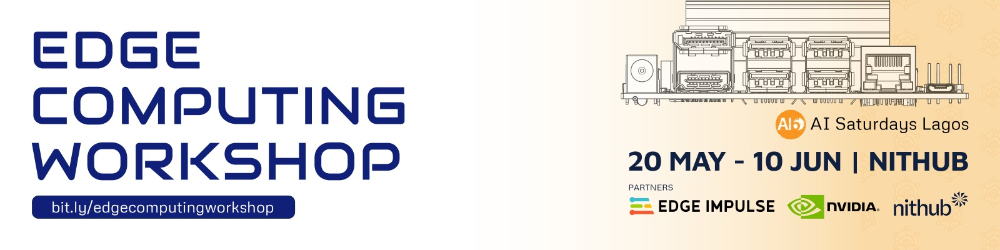

# AI6LAGOS EDGE COMPUTING WORKSHOP 2023

 The workshop is designed to foster an enabling environment for individuals to build competence in the Edge Computing space. At the end of the program, individuals will be able to deploy models on Nvidia Jetson devices and create custom models using the Edge Impulse platform. 

| Week | Date | Task | Duration |
|-----|------|------|------|
| 1    |  May 20th    | Introduction to Edge Compute     |  1hr    | 
|             |     |  Setting Up your Jetson Nano    |   2hr |
| 2    |  May 27th   | Introduction to Image classification    |  1hr    | 
|             |     |  Image classification on Jetson using Edge Impulse   |  2hr    | 
| 3    |  June 3rd    | Introduction to Image Regression   |  1hr    | 
|             |     |  Image Regression with on Jetson Nano    |  2hr    | 
| 4    |  June 10th   | Custom deploying on Jetson Nano using Edge Impulse     | 2hr    | 
|             |     |  Introduction to Gstreamer/Deepstream   |  1hr    | 
|             |     |  Issuing  Certification at the end of the program    |  10-30min    | 

## Course, Platform and Tools 
- [Getting Started with AI on Jetson](https://courses.nvidia.com/courses/course-v1:DLI+S-RX-02+V2/) 
- [Edge Impulse](https://www.edgeimpulse.com/)
- [Jetson Nano](https://developer.nvidia.com/embedded/jetson-nano-developer-kit)

## Basic Requirements 
- Basic knowledge of python(variable, function, etc)
- Knowledge/Interest in computer vision
- An element of curiosity 

## What you are expected to gain from the program 
- Learn how to use building models using Edge Impulse and deploy your models on Jetson Nano
- Learn how to use Docker, Numpy, Pandas, Jupyter Notebook etc 
- Learn how to build custom models
- Nvidia Deep Learning Certificate 

Workshop Material 
- [Week 1](https://docs.google.com/presentation/d/1Ife9oXupc0jdurz8OpKKgqQfPycReCQJTC5_gqc5L3c/edit#slide=id.g244451957ee_0_1014)
- [Week 2](https://docs.google.com/presentation/d/1XWsyqMV0qWNydiazBFBhmSQ0RGoVfbG9RR_gB1fk6YA/edit#slide=id.g2461e0ba8aa_0_302)

## Reference 
- [Book: AI at the edge](https://www.oreilly.com/library/view/ai-at-the/9781098120191/)
- [Installation of Edge Impulse](https://docs.edgeimpulse.com/docs/edge-impulse-cli/cli-installation)
- [Article: What Is Edge AI and How Does It Work?](https://blogs.nvidia.com/blog/2022/02/17/what-is-edge-ai/)
- [Workshop advantech Jetson Nano](https://github.com/edgeimpulse/workshop-advantech-jetson-nano)
- [Machine Learning at the Network Edge: A Survey](https://arxiv.org/pdf/1908.00080.pdf)
- [Edge AI 101- What is it, Why is it important, and How to implement Edge AI?](https://www.seeedstudio.com/blog/2021/04/02/edge-ai-what-is-it-and-what-can-it-do-for-edge-iot/)
- [Edge Computing Fuels a Sustainable Future for Energy](https://developer.nvidia.com/blog/edge-computing-fuels-a-sustainable-future-for-energy/#:~:text=Oil%20and%20gas%20enterprises%20and,sources%20of%20energy%20to%20consumers.)
- [Manufacturing the Future of AI with Edge Computing](https://developer.nvidia.com/blog/manufacturing-the-future-of-ai-with-edge-computing/)
- [AI Personalizes Online Shopping](https://developer.nvidia.com/blog/top-3-pillars-of-ai-enabled-edge-computing-in-retail/)