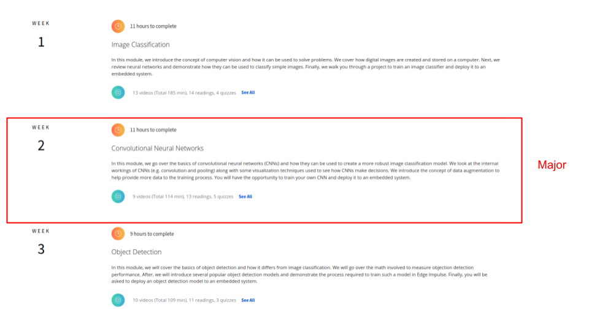
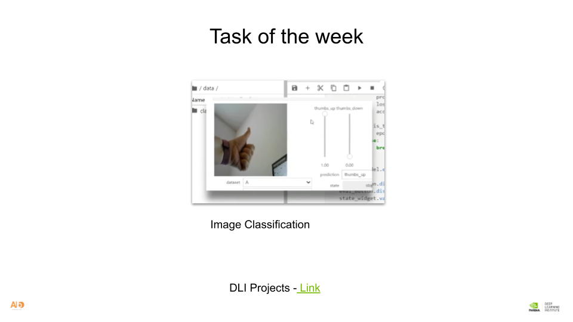

# AI6LAGOS EDGE COMPUTING WORKSHOP 2023
WEEK3 Reading

 

## Class Task
Task 1 : Run the image classification and regression task in the DLI program.  
 
Task 2 :  Setup and build object detection model for computer vision task
 
## Reference 
- [High-Speed Object Detection with Jetson Nano and Edge Impulse](https://www.youtube.com/watch?v=_T6h3Jmq2Yk)
- [Nvidia Jetson Nano](https://docs.edgeimpulse.com/docs/development-platforms/officially-supported-cpu-gpu-targets/nvidia-jetson-nano)
