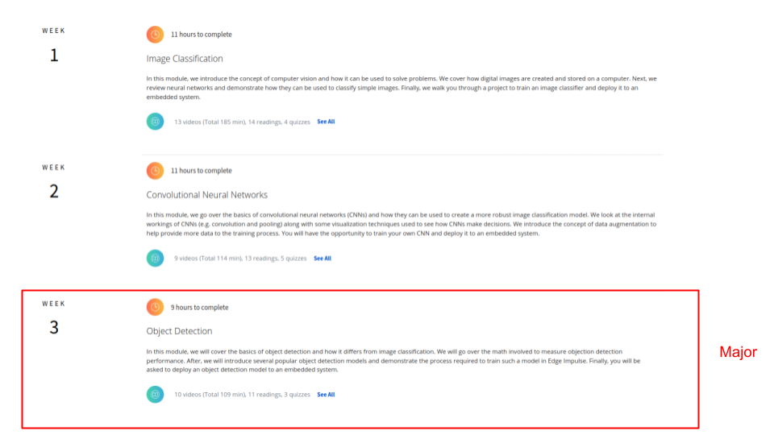
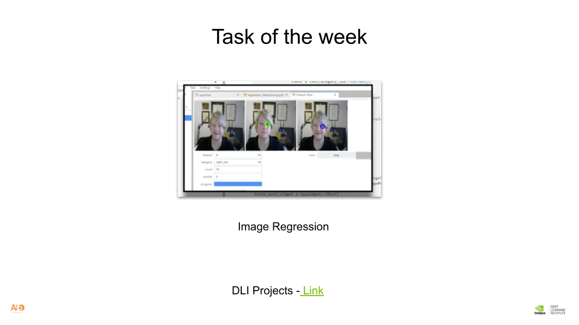
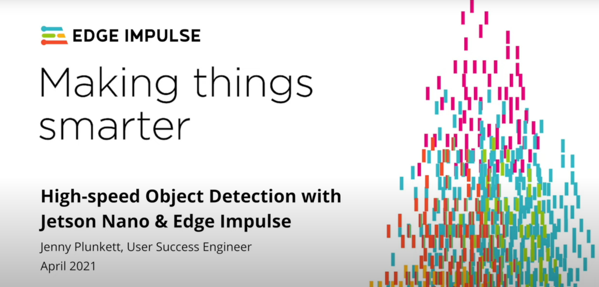

# AI6LAGOS EDGE COMPUTING WORKSHOP 2023
WEEK4 Reading

 

## Class Task
#### Task 1 : Run the image regression task in the DLI program.  
 

#### Task 2 :  Setup and build object detection model for computer vision task using Edge Impulse 
##### On x86_64(Ubuntu/Debian):
You can follow the instruction - [Link](https://docs.edgeimpulse.com/docs/development-platforms/officially-supported-cpu-gpu-targets/linux-x86_64) 
```
sudo apt install -y curl
curl -sL https://deb.nodesource.com/setup_14.x | sudo bash -
sudo apt install -y gcc g++ make build-essential nodejs sox gstreamer1.0-tools gstreamer1.0-plugins-good gstreamer1.0-plugins-base gstreamer1.0-plugins-base-apps
npm config set user root && sudo npm install edge-impulse-linux -g --unsafe-perm
```
##### On Jetson: 
You can follow the instruction - [Link](https://docs.edgeimpulse.com/docs/development-platforms/officially-supported-cpu-gpu-targets/nvidia-jetson-nano) 
 

Before starting anything, it might be good to update everything. You can do that by entering the commands below:
```
sudo apt-get update
sudo apt-get upgrade
```
From the terminal, run to install Edge Impulse and its dependencies:

```
 wget -q -O - https://cdn.edgeimpulse.com/firmware/linux/jetson.sh | bash
 ```
 You should get a response that looks like the one below.
 ```
+ edge-impulse-linux@1.4.3
added 343 packages from 420 contributors in 81.696s
 ```
 Now, use the below command to run Edge Impulse:
 ```
 edge-impulse-linux
 ```
 You can verify the device:

 For x86_64: 
 

 For Jetson Nano: 
 

 You will be asked to log in to your Edge Impulse account. You’ll then be asked to choose a project, and finally to select a camera to connect to the project.

 ```
 ai6-jetson@ai6jetson-desktop:~/Documents$ edge-impulse-linux-runner
Edge Impulse Linux runner v1.4.3

[RUN] Downloading model...
[BLD] Created build job with ID 9690982
[BLD] Connected to job
[BLD] Scheduling job in cluster...
[BLD] Container image pulled!
[BLD] Job started
[BLD] Scheduling job in cluster...
[BLD] Container image pulled!
[BLD] Job started
[BLD] Exporting TensorFlow Lite model...
[BLD] Exporting TensorFlow Lite model OK
.
.
.
.
[BLD] Building binary OK
[RUN] Downloading model OK
[RUN] Stored model version in /home/ai6-jetson/.ei-linux-runner/models/187851/v10/model.eim
[RUN] Starting the image classifier for Edge Impulse Experts / synthetic_data_with_nvidia_replicator_and_edge_impulse_v2 (v10)
[RUN] Parameters image size 320x320 px (3 channels) classes [ 'fork', 'knife', 'spoon' ]
[RUN] Using camera HD Pro Webcam C920 starting...
[RUN] Connected to camera

Want to see a feed of the camera and live classification in your browser? Go to http://19*.*.*.*:4912

boundingBoxes 179ms. [{"height":136,"label":"fork","value":0.7591571807861328,"width":134,"x":0,"y":176},{"height":170,"label":"fork","value":0.6790993213653564,"width":52,"x":180,"y":3}]
 ```

## Setting up Deepstream Docker on Jetson
Pull from Nvidia NGC: 
 ```
sudo docker pull nvcr.io/nvidia/deepstream:6.1.1-samples
 ```

 ```
 i6-jetson@ai6jetson-desktop:~/Documents$ sudo docker pull nvcr.io/nvidia/deepstream:6.1.1-samples
6.1.1-samples: Pulling from nvidia/deepstream
3b65ec22a9e9: Pulling fs layer 
9bfa49b064c8: Pulling fs layer 
cde16ef91ac2: Pulling fs layer 
978ea3dcd5fb: Waiting 
cde16ef91ac2: Downloading [===============================>                   ]  30.46MB/47.88MB
25e1b86ea3b6: Downloading [>                                                  ]  11.34MB/1.086GB
ab995ea0d0d0: Waiting 
6f67c1a28e38: Waiting 
1f4505fd2b95: Waiting 
816c2238973f: Waiting 
```

Start the Docker Container: 
```
sudo chmod a+x deepstream.sh
```
Run the container in the docker container: 
```
docker exec -it deepstream bash
deepstream-app --version
```

## Reference 
- [Computer Vision with Embedded Machine Learning](https://www.coursera.org/learn/computer-vision-with-embedded-machine-learning)
- [High-Speed Object Detection with Jetson Nano and Edge Impulse](https://www.youtube.com/watch?v=_T6h3Jmq2Yk)
- [Nvidia Jetson Nano](https://docs.edgeimpulse.com/docs/development-platforms/officially-supported-cpu-gpu-targets/nvidia-jetson-nano)
- [Face mask detector using Edge Impulse and Nvidia Jetson](https://www.hackster.io/shahizat/face-mask-detector-using-edge-impulse-and-nvidia-jetson-8c4dda)
- [Jetson Product Lifecycle](https://developer.nvidia.com/embedded/lifecycle)
- [Data Collection](https://d3c33hcgiwev3.cloudfront.net/PWxt1WoJS_qsbdVqCev6SA_0b8fe1563e5a421eb9aab4af06a64ef1_slides-1.1.3.pdf?Expires=1685836800&Signature=ZPePuRmXwr6nYWlnN1b9kMaqSNjoi4IJVY9G95KxxG3XQ7AwNLS98WDH9oqAsDt~e7P5CBeoUPXPuB98iS7MmDD~t54814~lH1LjR5fB-glyh3xsCb25g34y36ElodL9QFwifCAtDp~AIB0w09aOZYrPZh2wDlY2novF7cYR-oc_&Key-Pair-Id=APKAJLTNE6QMUY6HBC5A)
- [Review of Module 1](https://d3c33hcgiwev3.cloudfront.net/48r074D2SniK9O-A9hp4DQ_c50632c224df4950b1e6d4e6beb663f1_slides-1.5.2.pdf?Expires=1685836800&Signature=auSFLC6cHOQgHDpWdQ796WJQ8XatPc6T4kLWp4HJmjhwAYgwFv9u1dhgFnwmSGdM4eDjnfHRqCvAFofQGaGrfFICegtvA-urV9LRpIhiAUV~i3w-Gcmw23UKD9w4HrZNAT3toQx6rlp5IdaDR4BNUELROE71rrRUUe5IcTLswPU_&Key-Pair-Id=APKAJLTNE6QMUY6HBC5A)
- [Overview of Digital Images](https://d3c33hcgiwev3.cloudfront.net/282OCuhFTlyNjgroRb5crg_da0b4ed3eef94242965bf4f014c5b6f1_slides-1.1.2.pdf?Expires=1685836800&Signature=ApXdiM1-n7V8wpBVtg7jLRoMISwtwouq3rFGTS1kKIE5BHygcOZVvXB45OvAeVCOBfFHU77Nmqe5eBHg1zRH40AadV3NHWPH40Sb0mbGFIxlNcIlM2pUV43DVXYHMYc~Sb~uyhmuBZUjHpQ~jsh0nShxM37sLGdpDs-LNK7~Y64_&Key-Pair-Id=APKAJLTNE6QMUY6HBC5A)
- [Nvidia Deepstream Docker](https://docs.nvidia.com/metropolis/deepstream/dev-guide/text/DS_docker_containers.html)
- [Setting up Deepstream](https://chirag4798.medium.com/nvidia-deepstream-101-a-beginners-guide-to-real-time-computer-vision-afefcb5d7fba)
- [Nvidia DeepStream 101: A step-by-step guide to creating your first DeepStream application](https://chirag4798.medium.com/nvidia-deepstream-101-a-step-by-step-guide-to-creating-your-first-deepstream-application-68148753cf96)